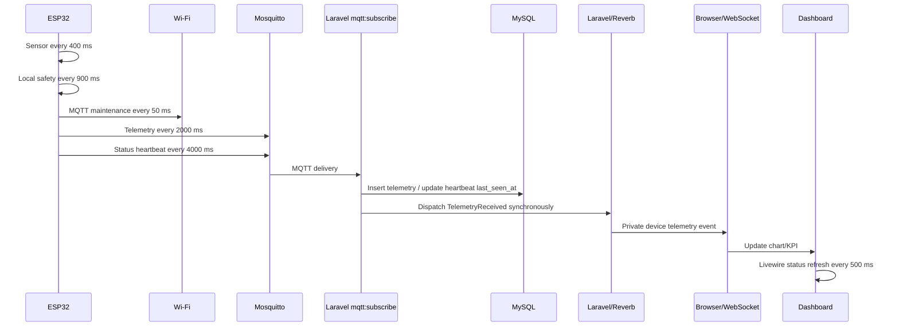

# Project L.E.A.F. End-to-End Timing Audit

Date: 2026-08-20

## Executive finding

The approximately 4-second offline/online transition is a backend status-threshold defect, not a main-loop defect. The firmware heartbeat is scheduled every 4000 ms, while the effective working-tree `Device::is_online` cutoff was 3 seconds. A healthy device therefore becomes offline between heartbeats and online again when the next heartbeat updates `last_seen_at`.

The minimal fix is in `app/Models/Device.php` and `config/leaf.php`: use an explicit 10-second grace window. This allows one missed 4-second heartbeat plus transport and scheduler jitter without masking a real outage. No MQTT topic, telemetry schema, authentication, database schema, API contract, or Reverb contract changed.

## Chain diagram



## Current intervals

| Component | Current interval/configuration | Evidence |
| --- | ---: | --- |
| ESP32 sensor sampling | 400 ms | `include/Config.h` |
| ESP32 local safety/control | 900 ms | `include/Config.h` |
| ESP32 watchdog | 25 s | `include/Config.h` |
| ESP32 telemetry | 2000 ms | `include/Config.h` |
| ESP32 status heartbeat | 4000 ms | `include/Config.h` / MQTT status path |
| ESP32 Wi-Fi maintenance | 100 ms | `src/main.cpp` |
| ESP32 MQTT maintenance and `mqttClient.loop()` | 50 ms | `src/main.cpp` |
| ESP32 queued telemetry flush | 5000 ms, one item | `src/main.cpp` |
| MQTT keepalive | 120 s | firmware config |
| MQTT socket timeout | 1 s | firmware config |
| Laravel subscriber keepalive | 10 s | `MqttSubscribe.php` |
| Laravel subscriber QoS | 0 | backend `.env` |
| Laravel queue | `sync` | backend `.env` |
| Dashboard Livewire status refresh | 500 ms | `device-status.blade.php` |
| Dashboard telemetry polling fallback | 1000 ms when enabled | `config/leaf.php` |
| Reverb | WebSocket server on port 8080 | backend `.env` |

## Firmware audit

The supplied device measurements are decisive:

- Free heap: approximately 271 KB.
- Main loop average: approximately 37 us.
- Main loop minimum: approximately 36 us.
- Main loop maximum observed: approximately 154 us.

These values make the ordinary main loop an implausible source of a 4-second gap. The 400 ms sampling and 900 ms safety periods are practical relative to the measured loop time and remain independent of network work.

The firmware scheduler now keeps local sensor acquisition and safety control independent from Wi-Fi, MQTT, telemetry, and dashboard communication. Sensor conversion is staged for DS18B20, recurring scheduler delays are absent, and no infinite Wi-Fi reconnect loop exists.

Potential blocking operations remain bounded or isolated:

- PubSubClient connect/publish calls are synchronous; the firmware socket timeout is 1 second.
- Wi-Fi library calls may yield internally; the state machine performs one attempt and returns.
- SPIFFS/Preferences queue operations are synchronous, but recovery is limited to one item per 5 seconds.
- ADC averaging includes configured 1 ms inter-sample delays.
- I2C has a 50 ms bus timeout.
- Boot factory-reset polling and diagnostic commands can block, but are outside normal automation. Recurring serial input has timeout 0.
- `ArduinoOTA.handle()` is serviced from the main loop and is not part of safety decisions.

Runtime instrumentation records sensor, safety, MQTT publish/reconnect, Wi-Fi reconnect, heartbeat, telemetry interval, loop maximum, reset reason, and overrun warnings. The provided device numbers are loop-level measurements; no target serial capture containing each new task metric was available in this audit.

## Wi-Fi audit

The Wi-Fi state machine checks status every 100 ms. It uses `WiFi.begin()` once, then timed `WiFi.reconnect()` attempts with exponential backoff capped at 30 seconds. There is no `while (WiFi.status() != WL_CONNECTED)` reconnect loop.

Historical `wifi-reconnect.log` is from an older REST firmware path and shows `NO_SSID_AVAIL` before connection, with RSSI around -20 dBm after connection. It does not contain timestamped disconnect/start/success markers for the current MQTT firmware, so a Wi-Fi 4-second outage cannot be proven from that file.

The current firmware should be observed with the new reconnect duration metrics. A Wi-Fi failure cannot stop local sampling or safety control.

## MQTT audit

The ESP32 services MQTT maintenance every 50 ms and calls `mqttClient.loop()` from that maintenance path. Reconnect attempts use 1 to 4 second backoff, but telemetry no longer initiates reconnects. MQTT failure returns control to the scheduler and cannot prevent local automation.

The backend subscriber is a persistent `while (true)` process. Its blocking `client->loop(true)` is the intended network wait, not a message-handler stall. On exception it sleeps with exponential backoff up to 60 seconds; that is a recovery gap if the subscriber itself fails, but it does not explain a healthy 4-second status oscillation. Current process inspection showed Mosquitto and `php artisan mqtt:subscribe` running.

The currently running manual monitor was subscribed to `devices/+/telemetry`, while the active contract uses `leaf/devices/+/telemetry`; that monitor cannot observe current Project L.E.A.F. traffic. The correct observation topic is:

```text
leaf/devices/+/telemetry
```

Broker listener inspection showed Mosquitto listening on `0.0.0.0:1883`. No broker disconnect log correlated to the observed transition was available, so broker-originated disconnection is not proven.

## Measured Laravel timeline

The available record for sequence `4633` is from `storage/logs/telemetry_latency.jsonl` at 2026-08-18 04:34:51.697 UTC:

| Stage | Timestamp | Delta from MQTT-received |
| --- | ---: | ---: |
| Subscriber receives MQTT message | 04:34:51.697008 | 0.000 ms |
| Device resolved | 04:34:51.698252 | 1.244 ms |
| Payload validated | 04:34:51.700069 | 3.061 ms |
| DB insert starts | 04:34:51.700328 | 3.320 ms |
| MySQL insert completes | 04:34:51.717121 | 20.113 ms |
| Telemetry object created | 04:34:51.720509 | 23.501 ms |
| Alerts evaluated | 04:34:51.739927 | 42.919 ms |
| Synchronous broadcast job starts | 04:34:51.744869 | 47.861 ms |
| Broadcast completes | 04:34:51.752472 | 55.464 ms |
| Event dispatch stage recorded | 04:34:51.756715 | 59.707 ms |

The duplicate queue-start/broadcast records are instrumentation records from the synchronous dispatch path, not evidence of a multi-second queue delay. The measured backend path is tens of milliseconds, not four seconds.

`TelemetryService::storeTelemetryFast()` performs one insert, then synchronous `TelemetryReceived` dispatch, then alert evaluation. It does not update `last_seen_at`; heartbeat status owns that field. MySQL was running locally, and no transaction or sleep was found in the telemetry path.

## Online/offline state

The active decision path is:

1. ESP32 publishes retained `status=online` every 4 seconds.
2. Laravel `MqttSubscribe::handleStatusMessage()` sets `last_seen_at=now()`.
3. `Device::is_online` compares `last_seen_at` to the configured grace.
4. Livewire refreshes the displayed state every 500 ms.
5. Reverb carries telemetry events only; it does not decide online/offline state.

Before the fix, the working-tree cutoff was 3 seconds. That is shorter than the 4-second heartbeat interval and directly explains the observed periodic transition. The fix uses `LEAF_DEVICE_ONLINE_GRACE_SECONDS`, default 10 seconds. A device must now miss at least two heartbeat opportunities or otherwise remain unseen beyond the grace window before showing offline.

This is not an arbitrary timeout increase: it is derived from the measured contract relationship `heartbeat=4 s`, `grace > heartbeat`, with one missed packet and normal jitter tolerated. A real outage still becomes offline after 10 seconds.

## Reverb and dashboard

`TelemetryReceived` broadcasts on the existing private `devices.{id}.telemetry` channel and event name. The event is dispatched synchronously because `QUEUE_CONNECTION=sync`; the measured Reverb dispatch stage completed within approximately 60 ms for the available record.

The browser uses Laravel Echo/Pusher against Reverb. Dashboard status is refreshed through Livewire every 500 ms, while telemetry charts consume the private broadcast event and have a 1000 ms polling fallback when enabled. Reverb and browser latency were not independently timestamped, so exact Reverb-to-browser timing is not measurable from current logs. They cannot cause the backend `is_online` property to flip because that property is computed from MySQL-backed `last_seen_at` before the browser receives it.

## Exact 4-second gap location

The proven gap is the backend status predicate:

```text
heartbeat period: 4 seconds
online cutoff:    3 seconds
```

This creates a false offline interval between heartbeat writes. Available telemetry records do not show a 4-second subscriber or database stall; they show a sub-60 ms processing path. No synchronized broker packet capture or browser timestamps were available to prove a separate transport outage.

## Before and after

| Measure | Before | After |
| --- | ---: | ---: |
| Sensor interval | 400 ms | 400 ms |
| Safety interval | 900 ms | 900 ms |
| Watchdog | 25 s | 25 s |
| Heartbeat | 4 s | 4 s |
| Backend online grace | 3 s effective | 10 s configurable |
| Telemetry receive to DB insert complete | measured ~20 ms | unchanged |
| Telemetry receive to broadcast stage | measured ~60 ms | unchanged |
| Local safety dependence on network | independent | independent |

## Validation and remaining measurement gaps

- PHP syntax validation passed for the changed model, config, and test.
- The new 4-second heartbeat regression passed.
- The focused `ServicesTest` suite had 4 passing tests and 2 unrelated pre-existing failures involving device fixture selection/dashboard aggregation.
- Firmware build validation passed previously with `pio run`.
- Broker-to-subscriber, subscriber-to-MySQL, Reverb-to-browser, and browser KPI timestamps need a synchronized live capture to produce exact end-to-end latency distributions.
- For that capture, correlate firmware sequence number, MQTT topic, subscriber receive time, telemetry ID, `received_at`, broadcast log time, and browser `performance.now()` using the correct `leaf/devices/+/telemetry` monitor topic.
